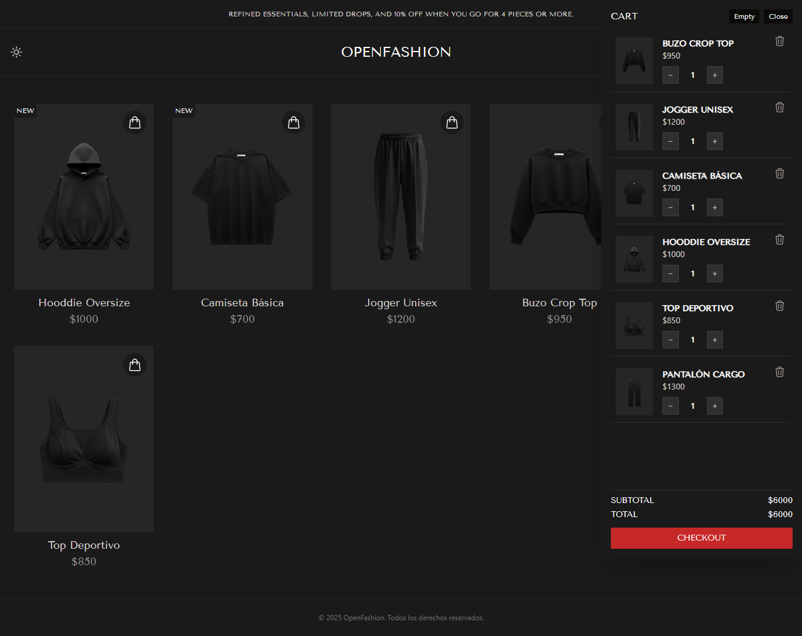
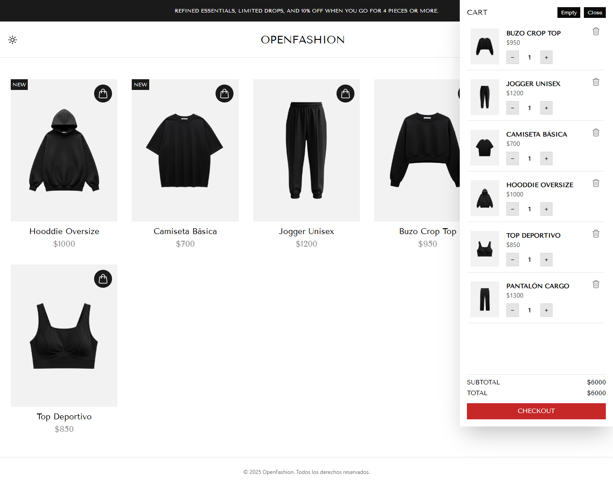

# Carrito de Compras React

Una aplicación personal desarrollada para practicar React, Tailwind CSS, manejo de estado global con Context, animaciones con framer-motion, persistencia con localStorage y toggle de tema claro/oscuro.

---

## 🛠 Tecnologías utilizadas

- ⚛️ React (Vite) — Framework moderno para construir interfaces reactivas y rápidas.  
- 💨 Tailwind CSS — Framework de utilidades para estilos CSS rápidos y responsivos.  
- 🔄 useState, useEffect y Context — Para manejo de estado local y global, efectos secundarios y comunicación entre componentes.  
- 💾 localStorage — Para persistir el estado del carrito y la preferencia de tema entre recargas.  
- 🧩 Componentes reutilizables — Organización modular y escalable del código.  

---

## 🌈 Funcionalidad principal

- Mostrar una lista de productos con imagen, nombre y precio.  
- Agregar o quitar productos del carrito de compras.  
- Visualizar el carrito en un modal emergente con listado de productos y cantidades.  
- Actualizar cantidades y eliminar productos directamente desde el modal.  
- Persistir el contenido del carrito en el navegador usando localStorage.  
- Botones dinámicos que cambian su texto y estilo según el estado (agregado o no).  
- Animaciones para interacción y mejora UX.  
- Toggle de tema claro/oscuro con persistencia de la preferencia del usuario.

---

## 🔗 Links

- **Vista previa pública (public folder):** 

- **Live Link (Netlify):** [View project on Netlify](https://celadon-mooncake-66b847.netlify.app/)

